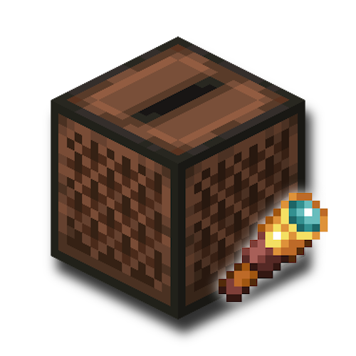

# juketify




a better jukebox. right click ur jukebox, enter the music you wanna listen to and it'll find it and play it for you from the jukebox. everyone nearby hears it too, with real distance falloff.

if you don't already have the song it searches for it online, downloads it once, and it just plays for everyone in range after that.

built for minecraft 26.1.2.

## setup

drop `.ogg` files into the `music` folder in your game dir. gets created the first time you run the game.

name them `Artist - Title.ogg` so search actually works well. no dash still works, it just matches on the whole filename then.

only ogg vorbis works, that's literally the only format minecraft's audio engine can decode (same reason resource packs use it). convert stuff with ffmpeg:

```
ffmpeg -i song.mp3 -c:a libvorbis -q:a 5 "Artist - Title.ogg"
```

## server side

whoever's hosting needs `yt-dlp` and `ffmpeg` installed and on PATH on their own machine. that's what actually does the searching and converting when someone asks for a song that isn't cached yet.

everything rides over the same minecraft connection, game + the music itself, so there's no extra port to forward or anything else to open up. first time anyone asks for a new song there's a real wait while it searches and downloads, after that it's cached and instant for everyone.

hearing range is set with `/juketify radius <blocks>`, needs gamemaster. no args just tells you what it's currently set to. 16-128, defaults to 64.

if sending tracks to people is choking your upload, `config/juketify.txt` has `chunksPerTick` and `inFlight`. lower them to go easier on the connection, raise them to send faster. the file has notes explaining both.

## using it

right click a jukebox with an empty hand to open it. holding a music disc still works normally.

you get a scrollable list of every track the server has, not just yours. click one to play it, or if something's already playing it goes on the queue instead. when a track ends the next one starts on its own.

type in the box to filter the list. if nothing matches, hit enter and it searches online, downloads it, and adds it.

- **stop** stops it and clears the queue for everyone in range
- **skip** jumps to the next thing in the queue
- **rescan** re-reads the music folder without restarting
- breaking the jukebox stops it too

everyone in range sees what's playing, not just whoever put it on. joining mid-song, changing dimension, or walking into range syncs you to where the track currently is instead of restarting it.

## building

needs jdk 25, minecraft 26.1.2 requires it.

```
./gradlew build
```

jar ends up in `build/libs`. grab the plain one, not the `-sources` one.

run a dev client:

```
./gradlew runClient
```

## disclaimer

online search works by calling out to these on whoever's hosting - this mod doesn't bundle or auto-install them, you need them on PATH yourself:

* [yt-dlp](https://github.com/yt-dlp/yt-dlp) ([Unlicense](https://github.com/yt-dlp/yt-dlp/blob/master/LICENSE)): finds and downloads audio from whatever you search for.
* [ffmpeg](https://ffmpeg.org/) ([LGPL/GPL](https://ffmpeg.org/legal.html)): converts what's downloaded into ogg vorbis.

what gets searched for and downloaded is entirely up to whoever's typing into the jukebox. it's on you (and whoever's hosting) to comply with copyright law and the terms of service of whatever site yt-dlp pulls from. i'm not responsible for what people search for or how this gets used.

## license

CC BY-NC-SA 4.0 - use it, modify it, put it in your modpack, just don't sell it or lock it behind a paywall, and keep it under the same license if you redistribute a modified version. full text in [LICENSE](LICENSE).
